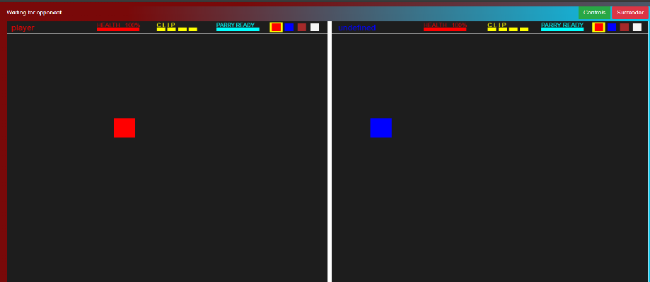

#### Welcome to Element Battle Arena - an elemental online 1v1 battle

#### To run locally:

Start the game by running `node server.js` in the project directory, and open [http://localhost:3000](http://localhost:3000) in a browser

Here are some guidelines:

Move using the `Arrow Keys`
Switch elements using `QWER`

`D` is used to `Parry`.
`F` is used to shoot your element.

You need to `Parry` right before a shot hits you to deflect it back.

Combos:
fire + earth = meteor
fire + air = lightning
earth + water = plant
water + air = ice

Counters:
fire + water
earth + air

